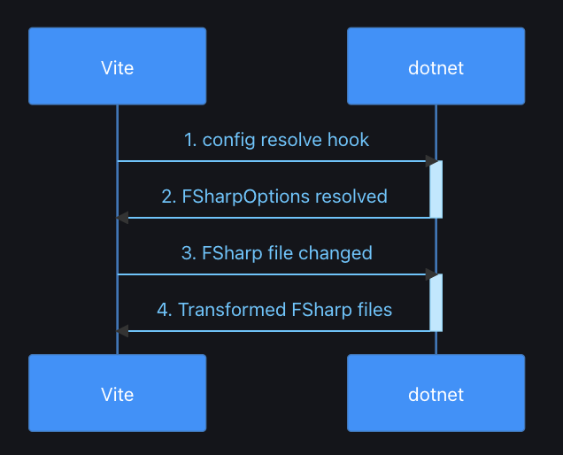

# React + Vite + Feliz

This template provides a minimal setup to get React working in Vite with HMR and some ESLint rules, it starts from the basic vite template but it was adapted to run [F#](https://dotnet.microsoft.com/en-us/languages/fsharp) via [Fable](https://fable.io/), and use [Feliz](https://zaid-ajaj.github.io/Feliz/) library for awesome React built in F# DSL. 

As an alternative to the official dotnet [template for Feliz](https://zaid-ajaj.github.io/Feliz/#/Feliz/ProjectTemplate) it adopts the remarkable [Vite Fable Plugin](https://nojaf.com/vite-plugin-fable/). 

 

Currently, two official plugins are available (for react):

- [@vitejs/plugin-react](https://github.com/vitejs/vite-plugin-react/blob/main/packages/plugin-react/README.md) uses [Babel](https://babeljs.io/) for Fast Refresh
- [@vitejs/plugin-react-swc](https://github.com/vitejs/vite-plugin-react-swc) uses [SWC](https://swc.rs/) for Fast Refresh

